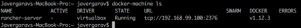
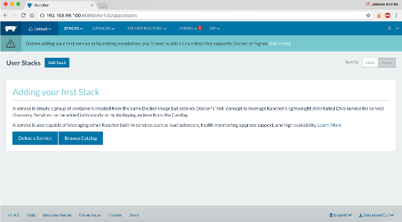
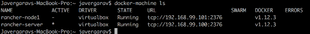
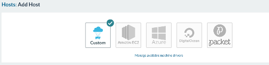
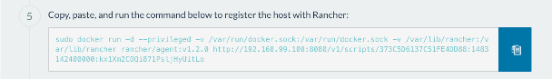
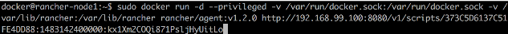
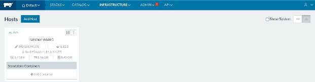

<p align="center">
  
  <br>
</p>

<p align="center">
  <b>Jeisson Andrés Vergara Vargas, M.Sc. (c)</b>
  <br>
  <b>Software Architecture</b>
  <br>
  <b>2018-I</b>
</p>
<br><br>

### Pre-requisitos

**1.** Descargar e instalar Oracle VM VirtualBox (se recomienda la versión 5.0).</li>


### Instalación de Docker

**2.** Descargar e instalar Docker según el sistema operativo:    
* [Mac OS]( https://www.docker.com/products/docker#/mac.)

* [Windows]( https://www.docker.com/products/docker#/windows.) - (Se recomienda instalar Docker Toolbox).
* [Linux]( https://www.docker.com/products/docker#/linux.)

### Creación de Máquinas Virtuales


   **3.** Crear servidor Rancher:

```docker-machine create -d virtualbox --virtualbox-memory "1024"  --virtualbox-cpu-count "-1" --virtualbox-disk-size "5000" --virtualbox-boot2docker-url https://github.com/boot2docker/boot2docker/releases/download/v1.12.3/boot2docker.iso  rancher-server```

   **4.** Verificar máquina creada:
> ```docker-machine ls```

   

   **5.** Ubicarse en la máquina creada previamente:

> ```eval $(docker-machine env rancher-server)```

   **6.** Ejecutar contenedor Rancher en el puerto 8080:

> `docker run -d --restart=always --name=rancher-server -p 8080:8080 rancher/server`

   **7.** Acceder al panel de control de Rancher:

> `http://192.168.99.100:8080/`
   
   

   **8.** Crear Nodo 1

> `docker-machine create -d virtualbox --virtualbox-memory "2048" --virtualbox-cpu-count "1" --virtualbox-disk-size "10000" --virtualbox-boot2docker-url https://github.com/boot2docker/boot2docker/releases/download/v1.12.3/boot2docker.iso --engine-storage-driver overlay rancher-node1`

   **9.** Verificar máquina creada:

> `docker-machine ls`
    
  

   **10.** Ingresar al Nodo 1 por medio de SSH:

> `docker-machine ssh rancher-node1`

   **11.** Ejecutar el siguiente comando:

> `sudo mkdir /mnt/sda1/var/lib/rancher`

   **12.** Ejecutar el siguiente archivo:

> `sudo vi /var/lib/boot2docker/profile`

   **13.** Agregar las siguientes líneas al final del archivo:

> `sudo mkdir /var/lib/rancher
   sudo mount -r /mnt/sda1/var/lib/rancher /var/lib/rancher`

   **14.** Guardar el archivo y ejecutar los siguientes comandos:

> `source /var/lib/boot2docker/profile
   exit`

   **15.** Reiniciar el equipo.

   **16.** Iniciar el servidor Rancher:

> `docker-machine start rancher-server`

   **17.** Iniciar el Nodo 1:

> `docker-machine start rancher-node1`

   **18.** En el panel de control de Rancher, acceder a **Infrastructure > Hosts > Add Host **, y seleccionar **Custom**:

   

   **19.** Copiar el comando disponible en el numeral 5:

   

   **20.** Ingresar al Nodo 1 por medio de SSH:

> `docker-machine ssh rancher-node1`

   **21.** Ejecutar el comando copiado en el paso 19:

   

   **22.** Verificar que el Nodo 1 haya sido añadido exitosamente :

   

   **23.** Ubicarse en el Nodo 1, con el fin de comenzar a ejecutar los servicios en él:

> `eval $(docker-machine env rancher-node1)`

